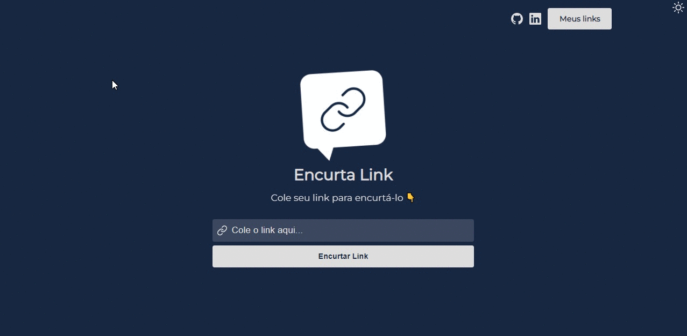

# ENCURTADOR DE LINKS

Projeto desenvolvido durante a semana React JS com o [Sujeito Programador](https://sujeitoprogramador.com/).

## Stack utilizada

1 React
* Hooks
  * useState  
  * useEffect  

2 React Router Dom
* Projeto construído com 3 rotas, sendo elas:
  * Home
  * Links
  * 404

3 [Axios](https://www.npmjs.com/package/axios)
* Para realizar a conexão com a API do [bitly](https://bitly.com/) e assim poder encurtar o link através do método POST

4 LocalStorage
* Utilizado para persistir os dados dos links encurtados, desta forma acessando a rota de links o usuário poderá ver, copiar ou deletar algum de seus links


## Diferenciais

Styled-components
* No projeto original, o mesmo foi desenvolvido com CSS, porém, preferi utilizar o styled-components para ter maior flexibilidade na escrita do CSS e para o desenvolvimento do Light e Dark Theme através do ThemeProvider.

[React-toastify](https://fkhadra.github.io/react-toastify/introduction)
* Uma biblioteca utilizada para gerar alertas conforme interação do usuário com a aplicação.
## Demonstração

Demonstração do projeto




## Instalação

Para rodar este e diversos outros projetos direto no seu computador, 
é preciso ter o nodejs instalado.

Para instalá-lo, [clique aqui](https://nodejs.org/en/).

Após a instalação:

Abra o prompt de comando ou terminal do vscode e cole o comando:

```bash
git clone https://github.com/DiegoLRamos/encurtaLink.git

```
Será feito o clone do projeto para o seu computador, após a finalização via prompt de comando ou terminal, acesse a pasta do projeto:

```bash
cd encurtaLink
```

Agora, digite o comando: 

```bash
npm install / yarn install
```

Aguarde a instalação das dependências e então, digite o comando:

```bash
npm start / yarn start
```

Aguarde a execução e uma nova aba no seu navegador será aberta com o projeto executando. Caso a aba não se abra, acesse:

```bash
http://localhost:3000 
```
